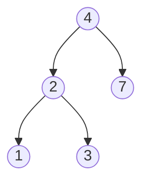

# 二叉搜索树中的搜索

二叉搜索树满足如下性质：

- 左子树所有节点的元素值均小于根的元素值；
- 右子树所有节点的元素值均大于根的元素值。



输入：root = [4,2,7,1,3], val = 2
输出：[2,1,3]

## 递归

```js
/**
 * Definition for a binary tree node.
 * function TreeNode(val, left, right) {
 *     this.val = (val===undefined ? 0 : val)
 *     this.left = (left===undefined ? null : left)
 *     this.right = (right===undefined ? null : right)
 * }
 */
/**
 * @param {TreeNode} root
 * @param {number} val
 * @return {TreeNode}
 */
var searchBST = function(root, val) {
  if(!root) {
    return null
  }
  if(root.val === val) {
    return root
  }
  return searchBST(val < root.val ? root.left : root.right, val)
};
```

## 迭代

```js
/**
 * Definition for a binary tree node.
 * function TreeNode(val, left, right) {
 *     this.val = (val===undefined ? 0 : val)
 *     this.left = (left===undefined ? null : left)
 *     this.right = (right===undefined ? null : right)
 * }
 */
/**
 * @param {TreeNode} root
 * @param {number} val
 * @return {TreeNode}
 */
var searchBST = function(root, val) {
  if(!root) {
    return null
  }
  while(root) {
    if(root.val === val) {
      return root
    }
    root = val < root.val ? root.left : root.right
  }
  return null
};
```
