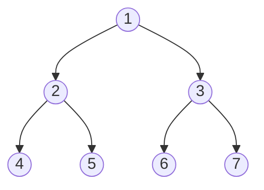

# 二叉树前序遍历



遍历顺序 ==左根右==： [4,2,5,1,6,3,7]

## 迭代法

思路：
先一直遍历左子树入栈
遍历完成后出栈取出最深度的左节点a
然后取出取出左节点a的根节点r
然后去遍历r的右子树
重复上述操作

```js
/**
 * Definition for a binary tree node.
 * function TreeNode(val, left, right) {
 *     this.val = (val===undefined ? 0 : val)
 *     this.left = (left===undefined ? null : left)
 *     this.right = (right===undefined ? null : right)
 * }
 */
/**
 * @param {TreeNode} root
 * @return {number[]}
 */
var inorderTraversal = function(root) {
  let res = []
  let stack = []
  let cur = root
  while(stack.length || cur) {
    if(cur) {
      stack.push(cur)
      cur = cur.left
    } else {
      cur = stack.pop()
      res.push(cur.val)
      cur = cur.right
    }
  }
  return res
};
```

## 递归法

```js
var inorderTraversal = function(root) {
    const res = [];
    const inorder = (root) => {
        if (!root) {
            return;
        }
        inorder(root.left);
        res.push(root.val);
        inorder(root.right);
    }
    inorder(root);
    return res;
};
```
