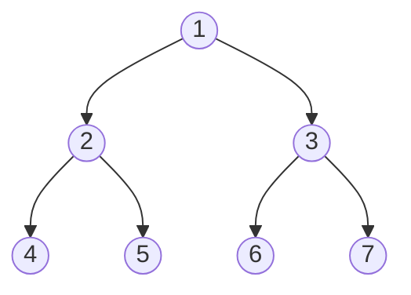

# 二叉树前序遍历



遍历顺序 ==根左右==： [1,2,4,5,3,6,7]

## 迭代法

```js
/**
 * Definition for a binary tree node.
 * function TreeNode(val, left, right) {
 *     this.val = (val===undefined ? 0 : val)
 *     this.left = (left===undefined ? null : left)
 *     this.right = (right===undefined ? null : right)
 * }
 */
/**
 * @param {TreeNode} root
 * @return {number[]}
 */
var preorderTraversal = function(root) {
    let res = [];
    if(!root) return res;
    const stack = [root];
    let cur = null;
    while(stack.length) {
        cur = stack.pop();
        // 结果值先入根元素的val
        res.push(cur.val);
        // 遍历数组先入右子树再入左子树 出栈的时候就会先遍历左子树
        cur.right && stack.push(cur.right);
        cur.left && stack.push(cur.left);
    }
    return res;
};
```

## 递归法

```js
var preorderTraversal = function(root) {
  let res = []
  const preorder = (root) => {
    if(!root) {
      return
    }
    res.push(root.val)
    preorder(root.left)
    preorder(root.right)
  }
  preorder(root)
  return res
};
```
