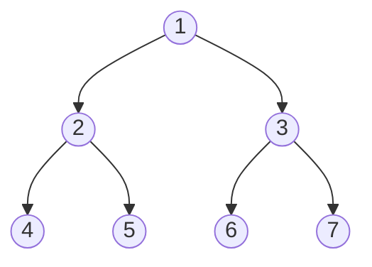

# 二叉树前序遍历



遍历顺序 ==左右根==： [4,5,2,6,7,3,1]

## 迭代法

```js
/**
 * Definition for a binary tree node.
 * function TreeNode(val, left, right) {
 *     this.val = (val===undefined ? 0 : val)
 *     this.left = (left===undefined ? null : left)
 *     this.right = (right===undefined ? null : right)
 * }
 */
/**
 * @param {TreeNode} root
 * @return {number[]}
 */
var postorderTraversal = function(root) {
  let res = []
  if(!root) {
    return res
  }
  let stack = [root]
  let cur = null
  while(stack.length) {
    cur = stack.pop()
    res.unshift(cur.val)
    cur.left && stack.push(cur.left)
    cur.right && stack.push(cur.right)
  }
  return res
};
```

## 递归法

```js
var postorderTraversal = function(root) {
    const res = [];
    const postorder = (root) => {
        if (!root) {
            return;
        }
        postorder(root.left);
        res.push(root.val);
        postorder(root.right);
    }
    postorder(root);
    return res;
};
```
