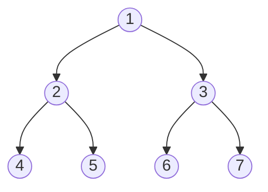

# js创建二叉树

```js
class TreeNode {
  constructor(data) {
    this.data = data; //数据域
    this.lchild = null; //左孩子
    this.rchild = null; //右孩子
  }
}

class BinaryTree {
  constructor() {}
  arrayToTree(arr) {
    return createTreeNode(arr, 0);
  }
}

/**
创建树的结点：根据二叉树的性质递归来创建
第 index 个结点的左子节点的位置 = index *2
第 index 个结点的右子节点的位置 = index *2 +1
我们使用数组的下标来表示位置，从0开始，就得到： index *2 +1 ; index *2 +2
 */
function createTreeNode(arr, index) {
  if (index > arr.length) {
    return null;
  }
  if (arr[index] == null) {
    return null;
  }
  const node = new TreeNode(arr[index]);
  node.lchild = createTreeNode(arr, index * 2 + 1);
  node.rchild = createTreeNode(arr, index * 2 + 2);
  return node;
}

const binaryTree = new BinaryTree()
const root = [3,9,20,null,null,15,7]
const tree = binaryTree.arrayToTree(root)
console.log(tree)
```

打印结果

```text
TreeNode {
  data: 3,
  lchild: TreeNode { data: 9, lchild: null, rchild: null },
  rchild: TreeNode {
    data: 20,
    lchild: TreeNode { data: 15, lchild: null, rchild: null },
    rchild: TreeNode { data: 7, lchild: null, rchild: null }  
  }
}
```


